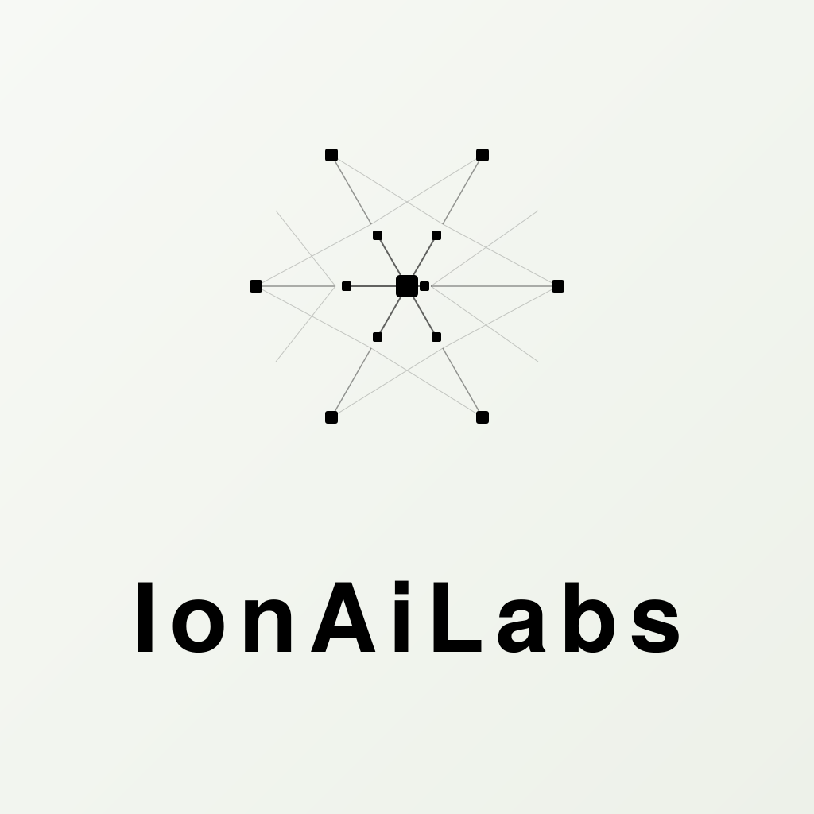

<p align="center">
  
</p>

<h1 align="center">IonAiLabs无限画布 (infinite-canvas)</h1>

<p align="center">
  <a href="https://linux.do/"></a>
  <a href="https://github.com/basketikun/infinite-canvas"></a>
  <a href="https://github.com/basketikun/infinite-canvas/tags"></a>
  <a href="LICENSE"></a>
  <a href="https://vite.dev/"></a>
  <a href="https://reactrouter.com/"></a>
</p>

<p align="center">
<a href="https://trendshift.io/repositories/50077?utm_source=repository-badge&amp;utm_medium=badge&amp;utm_campaign=badge-repository-50077" target="_blank" rel="noopener noreferrer"></a>
</p>

<p align="center">
  <a href="docs/content/docs/overview/quick-start.mdx">快速开始</a> · <a href="docs/content/docs/overview/features.mdx">功能介绍</a> · <a href="docs/content/docs/overview/docker.mdx">Docker 部署</a> · <a href="docs/content/docs/canvas/canvas-node-manual.mdx">画布节点操作手册</a> · <a href="docs/content/docs/canvas/canvas-shortcuts.mdx">画布快捷键</a> · <a href="SECURITY.md">漏洞提交</a> · <a href="docs/content/docs/progress/todo.mdx">待办事项</a>
</p>

IonAiLabs无限画布是一款面向多模态创作的开源工作台。它把画布编排、AI 图片生成、参考图编辑、文本创作、音频素材、提示词库和素材沉淀放在同一个界面里。

> [!CAUTION]
> 项目目前处于开发阶段，不保证历史数据兼容。各种本地存储格式都可能直接调整，欢迎关注后续更新。
>
> 如果你需要稳定维护自己的分支，建议自行 fork 后独立开发。二次开发与 PR 请保留原作者信息和前端页面标识。

## 赞助商

<table>
  <tr>
    <td width="190" align="center">
      <a href="https://www.atlascloud.ai/zh?utm_source=github&amp;utm_medium=link&amp;utm_campaign=infinite-canvas" target="_blank" rel="noopener noreferrer"></a>
    </td>
    <td>
      <a href="https://www.atlascloud.ai/zh?utm_source=github&amp;utm_medium=link&amp;utm_campaign=infinite-canvas" target="_blank" rel="noopener noreferrer">Atlas Cloud</a> is a full-modal AI inference platform that gives developers a single AI API to access video generation, image generation, and LLM APIs. Instead of managing multiple vendor integrations, you connect once and get unified access to 300+ curated models across all modalities. Check out <a href="https://www.atlascloud.ai/console/coding-plan" target="_blank" rel="noopener noreferrer">Atlas Cloud's new coding plan promotion</a> for more budget-friendly API access.
    </td>
  </tr>
  <tr>
    <td width="190" align="center">
      <a href="https://infistar.ai/register?aff=4X3V9NA9&amp;ref_source=link" target="_blank" rel="noopener noreferrer"></a>
    </td>
    <td>
      <strong>无限画布 × Infistar.ai 无限星河｜内置原生画布 · 全能多模态 API</strong> 💡 原生集成，即点即用： Infistar.ai 已原生上架无限画布！同时提供低至官方 1 折的稳定 API 中转服务，模型倍率与调用明细全程透明。 🎨 多模态生图/生视频： 完美适配 Seedance、FLUX、Midjourney、Sora、Runway、Luma、可灵（Kling）等顶级图片与视频大模型。 🧠 全系语言模型： 覆盖 OpenAI、Claude、Gemini、Grok、DeepSeek、Qwen、GLM 等国内外主流模型，兼容 OpenAI 标准接口。 ⚡ 动态调度： 多路供应保障高可用，拒绝断连。 🎁 专属福利： 通过 <a href="https://infistar.ai/register?aff=4X3V9NA9&amp;ref_source=link" target="_blank" rel="noopener noreferrer">专属链接</a> 注册，立享赠送额度/专属折扣/首充权益！
    </td>
  </tr>
</table>

## 核心功能

- IonAiLabs无限画布：多画布项目、节点拖拽缩放、连线、小地图、撤销重做、导入导出。
- AI 创作：浏览器只访问同域 Node API，由后端连接你配置的 OpenAI 兼容中转站，支持文生图、图生图、参考图编辑和文本问答。
- 插件系统：支持通过 URL 动态安装 / 启用 / 更新 / 卸载远程节点插件，并提供 TypeScript SDK 自行开发画布节点插件。
- 匿名配置：无需注册登录；每个浏览器匿名会话可保存多个中转站，API Key 使用服务器主密钥加密，前端不能读取或导出明文。
- 提示词库：浏览器前端直连多个 GitHub 开源项目，并缓存到 IndexedDB。

完整功能说明见 [功能介绍](docs/content/docs/overview/features.mdx)。

如果你在为担心没有合适的生图API来发愁，可以查看该免费生图项目：[chatgpt2api](https://github.com/basketikun/chatgpt2api)

## 快速开始

画布、素材、音频和完整生成记录保存在浏览器 IndexedDB；中转站配置与加密后的 API Key 保存在服务器 SQLite。服务器不保存画布或媒体。

### 生产 Docker 部署

```bash
git clone git@github.com:basketikun/infinite-canvas.git
cd infinite-canvas
cp .env.example .env
# 修改 .env，至少填写随机 API_KEY_MASTER_KEY 和 APP_ORIGIN
mkdir -p data && sudo chown -R 1000:1000 data && chmod 700 data
docker compose up -d --build
```

生产环境还需要在宿主机配置域名与 HTTPS，详见 [Docker 部署](docs/content/docs/overview/docker.mdx)。

### 本地 Docker 预览

```bash
docker compose -f docker-compose.local.yml up --build
```

运行后默认端口3000，可访问 `http://localhost:3000`。

首次打开后进入右上角配置，填入公网 HTTPS 的 OpenAI 兼容 `Base URL` 和 `API Key`。浏览器后续请求只会访问同域 `/api`。

## 效果展示

<table width="100%">
  <tr>
    <td width="50%"></td>
    <td width="50%"></td>
  </tr>
  <tr>
    <td width="50%"></td>
    <td width="50%"></td>
  </tr>
  <tr>
    <td width="50%"></td>
    <td width="50%"></td>
  </tr>
  <tr>
    <td width="50%"></td>
    <td width="50%"></td>
  </tr>
</table>

## 联系方式

项目定制二次开发需求 / 生图 API 需求可联系。

邮箱：1844025705@qq.com · QQ：1844025705

## 赞助支持

本项目长期开放广告赞助合作，欢迎品牌 / 产品投放，你的支持是持续更新的动力！

有广告赞助意向请通过上方联系方式沟通。

## 社区支持

学 AI，上 L 站：[LinuxDO](https://linux.do/)

点击链接加入群聊【AI开源交流】：https://qm.qq.com/q/DFnKzZ807u

## 开源协议

本项目使用 [MIT License](LICENSE)。任何人都可以免费使用、复制、修改、分发、再授权和商业使用本项目，也可以用于闭源产品。

## Star History

<a href="https://www.star-history.com/?repos=basketikun%2Finfinite-canvas&type=date&legend=top-left">
 <picture>
   <source media="(prefers-color-scheme: dark)" srcset="https://api.star-history.com/chart?repos=basketikun/infinite-canvas&type=date&theme=dark&legend=top-left" />
   <source media="(prefers-color-scheme: light)" srcset="https://api.star-history.com/chart?repos=basketikun/infinite-canvas&type=date&legend=top-left" />
   
 </picture>
</a>
